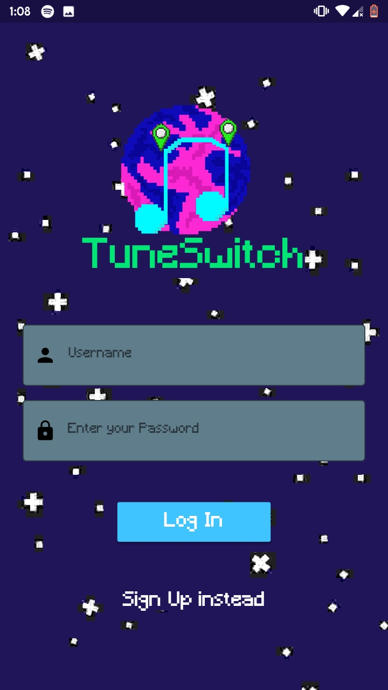
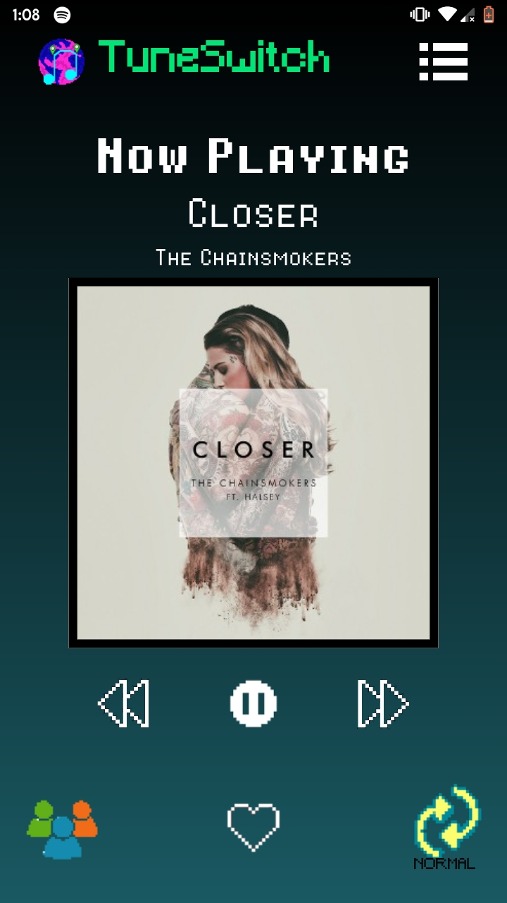
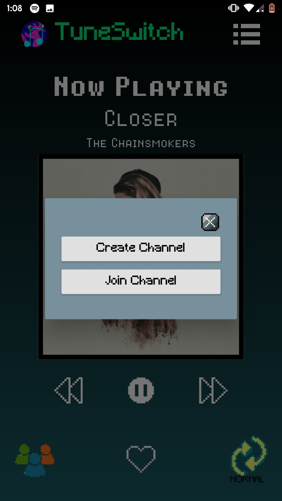

  

# TuneSwitch
An open source playlist randomiser for Spotify

## Overview
The app swaps music played by users online in multiple methods namely Normal,Travel and Channel Mode. App is made using Flutter and Python. Backend uses websocket connection with backend for real time swapping of music. The websocket part is implemented with Django Channels.The backend is deployed in Heroku.

## Features
* Location based music swapping
* Works real-time
* Decreased Latency
* Works on any device with Spotify.
* Create and join Private channels to swap music privately.
* Retro UI
* Under MIT license

## Dependencies
### Flutter
* [Spotify SDK](https://pub.dev/packages/spotify_sdk)
* [Web Socket Channel](https://pub.dev/packages/web_socket_channel)
* [Crypto](https://pub.dev/packages/crypto)
* [TimeAgo](https://pub.dev/packages/timeago)
* [Flutter Toast](https://pub.dev/packages/fluttertoast)
* [GeoLocator](https://pub.dev/packages/geolocator)
* [Flutter Launcher Icon](https://pub.dev/packages/flutter_launcher_icons)

### Python
* [Django](https://www.djangoproject.com/)
* [Django Rest Framework](https://www.django-rest-framework.org/)
* [Django Channels](https://channels.readthedocs.io/en/latest/)

## Screenshots

  
  
  

## Local Setup
### Flutter
* Go to [Spotify Developers](https://developer.spotify.com/dashboard/login) to obtain CLIENT_ID and setup a REDIRECT_URI there.
* Store the CLIENT_ID and REDIRECT_URI in .env file in root folder of Project.
* change the URL given in auth.dart to your own local URL.
* Run
``flutter pub get``
``flutter run``

### Django
* Install the packages in Backend/requirements.txt.
* Install Redis.
* Run
``python3 manage.py migrate``
``python3 manage.py runserver [YOUR_IP_ADDRESS]:8000``

## Issues
* No method to identify whether Spotify is installed in the running device.
* Location based music swapping can be Improved.
* Ads in spotify is not tolerated in some cases.
* When deployed, the request response time out creates a problem.

## Other
For more details on local setup and working mail me at creattech2000@gmail.com

